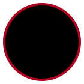

<!--
  README DE PERFIL - BRENO LOPES
  Visual preto/vermelho com estetica anime profissional.
-->

<h1>Breno Lopes</h1>

  <strong>Desenvolvedor em aprendizado</strong> 
  Front-End | Back-End | Python

  
  
  
  

---

<h3 align="center">sobre mim</h3>

  Estou estudando web, Python e automa&ccedil;&atilde;o. 
  Aqui ficam meus projetos, meus testes e um pouco do que eu vou aprendendo.

  <i>"O imposs&iacute;vel &eacute; s&oacute; quest&atilde;o de opini&atilde;o"</i>

---

<h3 align="center">stack</h3>

  
  
  
  
  
    
  
  
  
  
  

---

<h3 align="center">projetos</h3>

  

---

<h3 align="center">em evolu&ccedil;&atilde;o</h3>

  
  
  

---

<h3 align="center">fora do c&oacute;digo</h3>

  Jogos, filmes/s&eacute;ries e m&uacute;sica tamb&eacute;m aparecem por aqui.

  
  
  
  

---

<h3 align="center">contato</h3>

  

