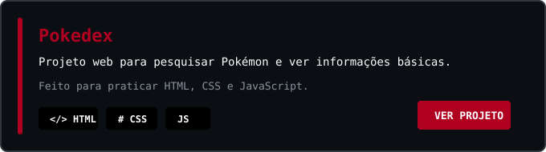

<!--
  README DE PERFIL - BRENO LOPES
  Visual preto/vermelho com estetica anime profissional.
-->

  

<h1>Breno Lopes</h1>

  <strong>Desenvolvedor em aprendizado</strong> 
  Front-End | Back-End | Python

  

  
  
  
  

---

<h3 align="center">sobre mim</h3>

  &#10022; Estou estudando web, Python e automa&ccedil;&atilde;o. 
  &#8961; Aqui ficam meus projetos da escola e alguns testes que fa&ccedil;o enquanto aprendo.

---

<h3 align="center">stack</h3>

  
  
  
  
  
    
  
  
  
  
  

---

<h3 align="center">projetos</h3>

  

---

<h3 align="center">em evolucao</h3>

  
  
  

---

<h3 align="center">contato</h3>

  

